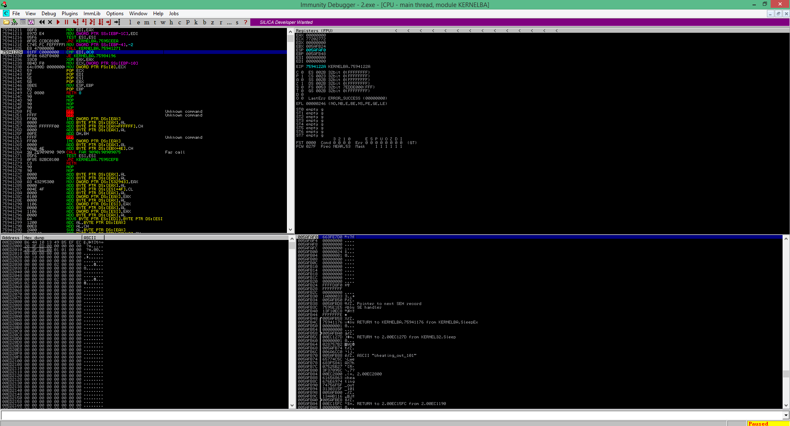

# Reversing 2 - 50

    Make 42424242 bigger.
[2.exe](2.exe)

------------------

Another reversing problem. we can try running ```strings 2.exe``` but this time it doesn't yield the flag.

It looks like we'll need a debugger. So, we open it up with [Immunity Debugger](http://www.immunityinc.com/products/debugger/).

We fiddle around a bit in the debugger with some breakpoints and suddenly, we find the flag listed!



Flag: ```{cheating_out_101}```