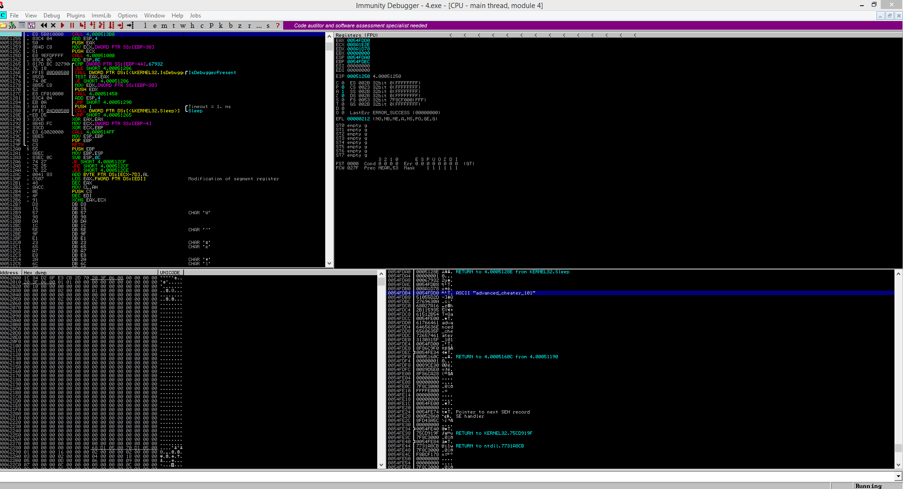

# Reversing 4 - 100
    It responds well to debugging. Maybe it also wants something larger than 424242.
[4.exe](4.exe)

------------------

Let's open it up with [Immunity Debugger](http://www.immunityinc.com/products/debugger/).

We run the program and in the memory stack, theres the flag.



Flag: ```{advanced_cheater_101}```