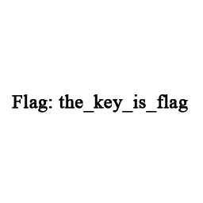

#The Key - 50

	The flag is in this exe.

[flag.exe](flag.exe)

----------------------

Looking at the hex data of flag.exe, we see that there are multiple PNGs in the file. We extract them one-by-one (by hand), and the last one in the exe is the flag!

Flag: `{the_key_is_flag}`