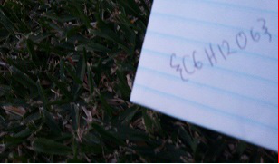

#Photo Synthesis 1 - 75

	My 2D photo has lost one of its dimensions!

[photosynthesis1.png](photosynthesis1.png)

-------------

We write some quick code to weave the image into 2 dimensions. First it makes an empty image with a target width, and then takes the pixels from the source image one-by-one, drawing them on the new canvas. The code can be found [here](solver1.py). There is a convenient red line at the right allowing us to get the width easier.

So the flag is `{C6H12O6}`