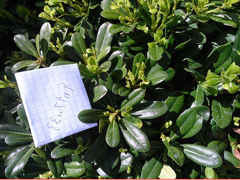
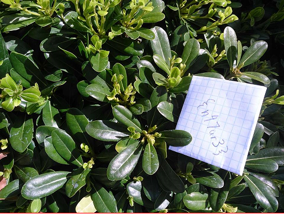

#Photo Synthesis 2 - 125

	Can you synthesize this photo?

[photosynthesis2.zip](photosynthesis2.zip)

-------------

First we extract the zip (I put them in a directory called `stupidimages`). Sadly, the file size is misleading, and there almost 200,000 files in there. For the sake of fast upload speeds, I have not put this directory in the github, so you'll have to extract it yourself :P

Next, we run [this](solver2.py) program to first weave the images together into one huge image, and then reuse the code from Photo Synthesis 1 to get the image. The image we get out, though, is flipped, so we manually flip it.

Flipped:

So the flag is `{n47ur3}`.