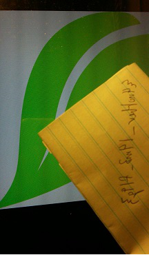
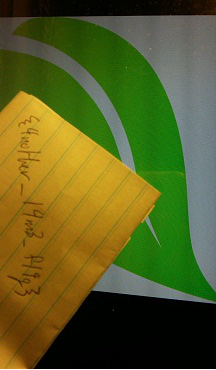

#Photo Synthesis 3 - 150

	Hmmmm....its not even a photo anymore. I'm sure you can synthesize one.

[photosynthesis3.txt](photosynthesis3.txt)

-------------

This time, we're given a text files with pixel values. No biggie, we can just change the code from looping over pixels from an image to instead looping lines of a file. The code can be found [here](solver3.py)

Rip, it's flipped again. We flip it for the flag!

Flag: `{4nother_l4m3_fl4g}`